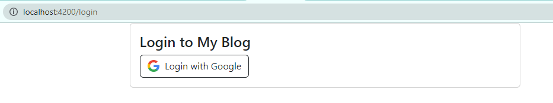
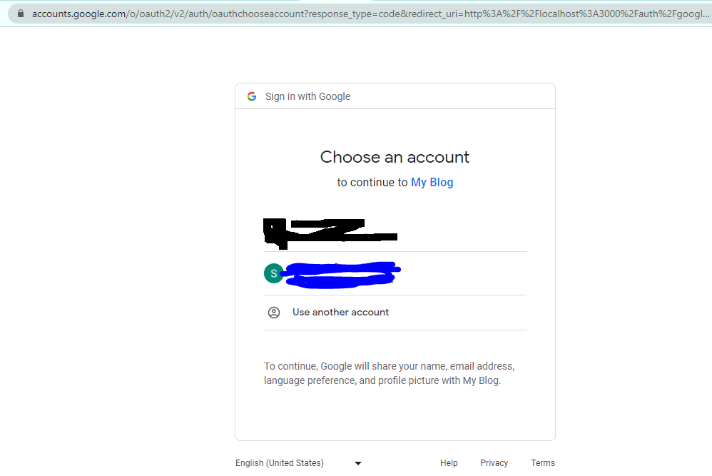
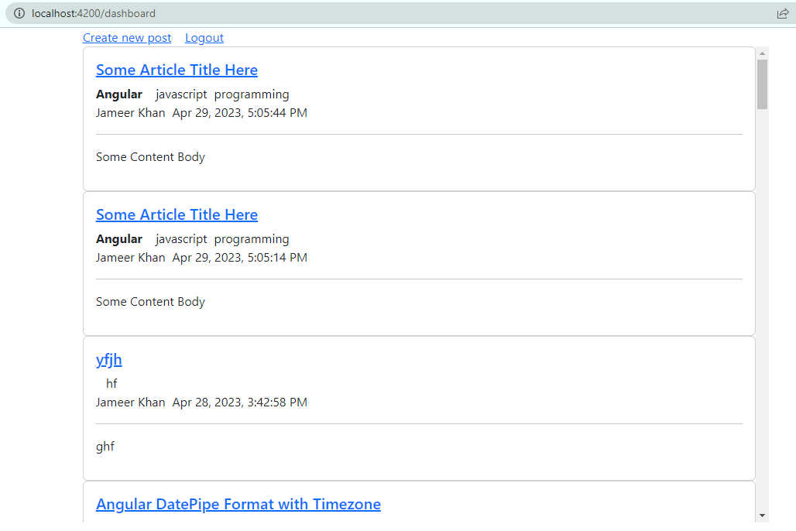
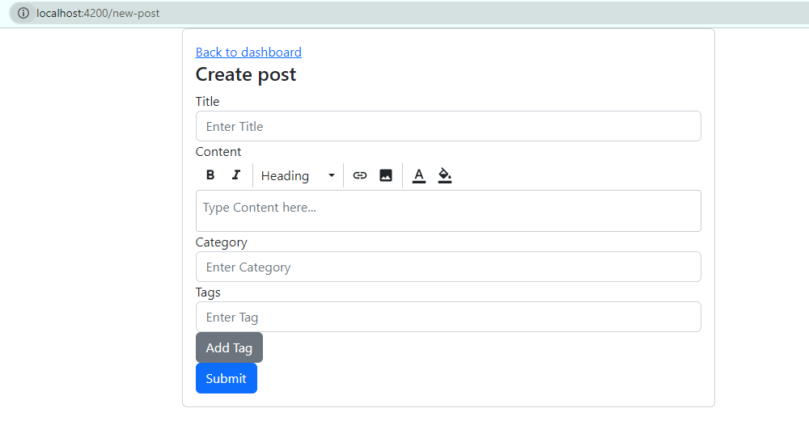
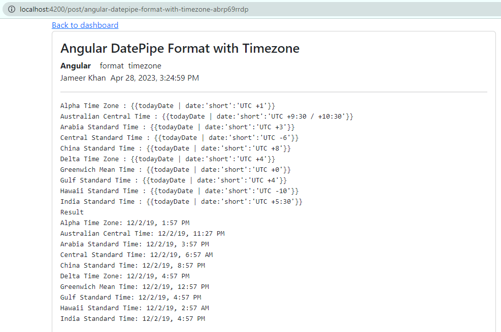

# devstack-blogger-ng-app

> CRUD Blog app in `Angular` v15 and `NestJS` with `MongoDB` and `Google Authentication`

## Getting Started

- This project was generated with [Angular CLI](https://github.com/angular/angular-cli) version `15.2.6`.

- Run `ng serve` for a dev server. Navigate to `http://localhost:4200/`. The application will automatically reload if you change any of the source files.

```bash
$ npm install

# ng serve --host 0.0.0.0
$ npm start
```

### Login Page



### Google Login



### Dashboard Page



### New Blog Post



### Blog Detail Page | Public



---

A Front End application that will be visible to users is built in Angular using RxJS Observables and Operators. It has features like:

    1. Login through Google Account
    2. A dashboard page to list all the blogs that user will create
    3. A create blog page where user can enter Blog Title, Body, Category and some Tags and hit save
    4. A blog detail page that opens when user clicks on a blog title from at the dashboard page
    5. Logout

&copy; 2024 @codeguru827

All rights reserved.
